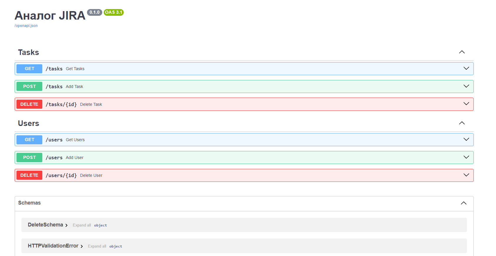

### Запуск приложения
1. Создать виртуальное окружение и установить зависимости командой `pip install -r requirements.txt`
2. Вызвать в терминале `alembic upgrade head`
3. Вызвать в терминале `python -m src.main`

### Документация к API

